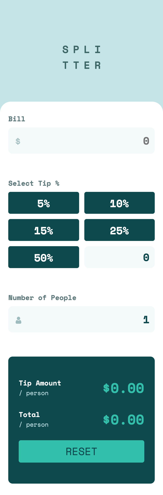

# Frontend Mentor - Tip calculator app solution by Eban

This project was generated with [Angular CLI](https://github.com/angular/angular-cli) version 13.0.2.

## Development server

Run `npm install` an then `ng serve` for a dev server. Navigate to `http://localhost:4200/`. The app will automatically reload if you change any of the source files.

## Build

Run `ng build` to build the project. The build artifacts will be stored in the `dist/` directory.

---

This is a solution to the [Tip calculator app challenge on Frontend Mentor](https://www.frontendmentor.io/challenges/tip-calculator-app-ugJNGbJUX). Frontend Mentor challenges help you improve your coding skills by building realistic projects.

## Table of contents

- [Overview](#overview)
  - [The challenge](#the-challenge)
  - [Screenshot](#screenshot)
  - [Links](#links)
- [My process](#my-process)
  - [Built with](#built-with)
  - [What I learned](#what-i-learned)
  - [Continued development](#continued-development)
  - [Useful resources](#useful-resources)
- [Author](#author)
- [Acknowledgments](#acknowledgments)

## Overview

### The challenge

Users should be able to:

- View the optimal layout for the app depending on their device's screen size
- See hover states for all interactive elements on the page
- Calculate the correct tip and total cost of the bill per person

### Screenshot

iPhone Viewport:

Macbook Viewport:

Tablet Viewport:


### Links

- Solution URL: [github/tip-calculator](https://github.com/ebanguz/tip-calculator)
- Live Site URL: [ebansplitter.app](ebansplitter.netlify.app)

## My process

### Built with

- Semantic HTML5 markup
- SCSS custom properties
- Flexbox
- CSS Grid
- Mobile-first workflow
- [Angular](https://angular.io/) - JS framework
- [Angular PWA](https://angular.io/guide/service-worker-getting-started) - PWA
- [Styled Components](https://styled-components.com/) - For styles
- [Reactive Forms](https://angular.io/guide/reactive-forms)

### What I learned

What I learned in this project

To see how you can add code snippets, see below:

```html

```

```scss
input[type="radio"] {
  display: none;

  &:checked + label {
    color: a.$veryDarkCyan;
    background: a.$strongCyan;
  }
}
```

Form Control

```html
<form class="form" [formGroup]="form" (change)="isReady()">
  <div class="form__div">
    <label class="form__label">Bill</label>
    <input
      type="number"
      formControlName="bill"
      [class.is-invalid]="billValid"
    />
  </div>

  <div class="form__div">
    <label class="form__label">Select Tip %</label>

    <input type="radio" name="tipPercentage" formControlName="tipPercentage" />
    <label for="five">5%</label>

    <label for="custom">Custom percent</label>
    <input type="number" name="tipPercentage" formControlName="tipPercentage" />
  </div>

  <div class="form__div">
    <input
      type="number"
      appNumberOnly
      formControlName="numberPeople"
      [class.is-invalid]="numberPeopleValid"
    />
  </div>
</form>
```

```typescript
function createForm() {
  this.form = this.fb.group({
    bill: ["", [Validators.required, Validators.min(1)]],
    tipPercentage: [0, []],
    numberPeople: [1, [Validators.required, Validators.min(1)]],
  });
}
```

### Continued development

Still a lot of things to develop

### Useful resources

- [Angular docs](https://angular.io/docs) - This helped me for PWA implementation.

- [Angular course](https://www.udemy.com/course/angular-2-fernando-herrera/) - This is an amazing course which helped me finally understand Angular. I'd recommend it to anyone still learning from this.

## Author

- Frontend Mentor - [@ebanguz](https://www.frontendmentor.io/profile/yourusername)
- Twitter - [@eban_guz](https://www.twitter.com/eban_guz)
